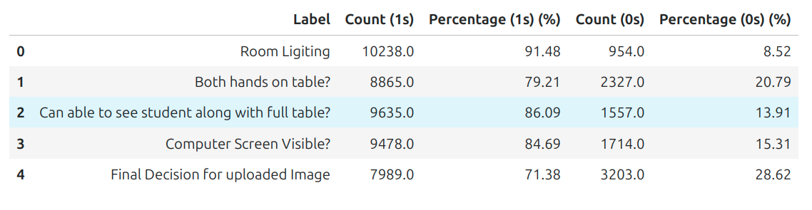
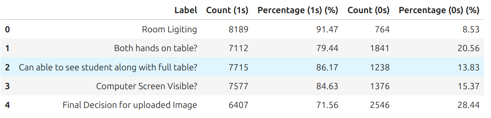
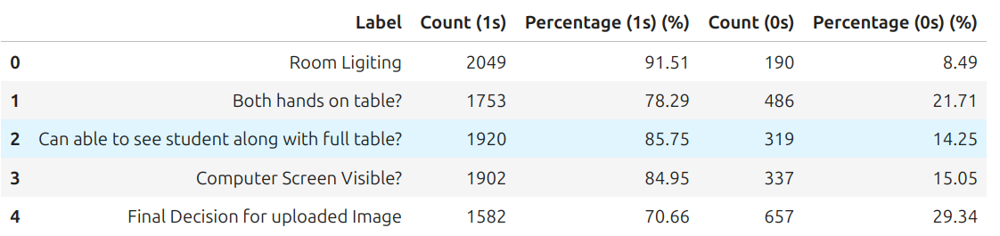
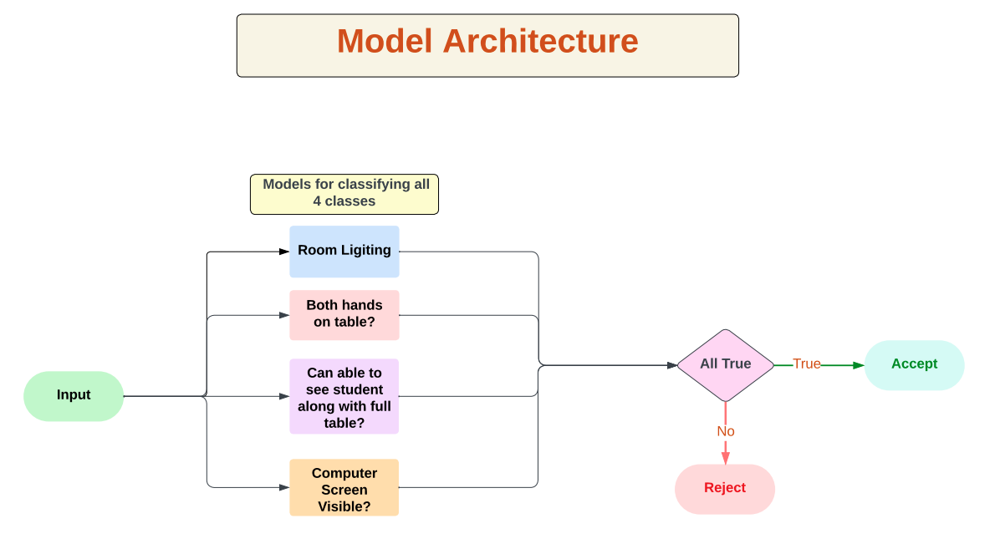
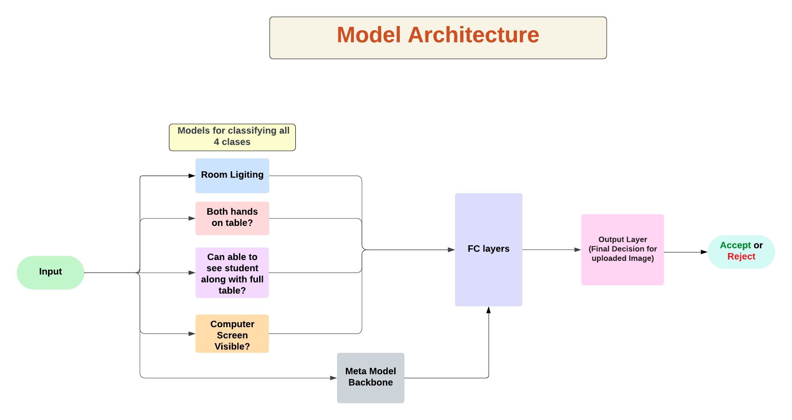

# 📘 **SCT Project**

## Dataset Overview

### **Final Dataset Details**

- **Image Size (after preprocessing):** 240x240
- **Total Samples:** 11,200
- **Feature Columns:**
  1. **PositionImage_FileName**
  2. **Room Lighting**
  3. **Both hands on table?**
  4. **Can able to see student along with full table?**
  5. **Computer Screen Visible?**

### **Final Decision for Uploaded Image**

- The dataset includes a target class: **Final Decision for Uploaded Image**.

### **Modified Classes in the Dataset**

#### Subclasses:

1. **Room Lighting**
2. **Both hands on table?**
3. **Can able to see student along with full table?**
4. **Computer Screen Visible?**

#### Final Output Class:

- **Final Decision for Uploaded Image**

---

## Dataset

### **Dataset Link**

[Download Dataset](#)

### **Training & Validation Datasets**

- **Total Dataset**  
  
- **Training Dataset (80% of Total Dataset)**  
  
- **Validation Dataset (20% of Total Dataset)**  
  

---

## Model Training

### **Model Architectures**

1. **Model_1:** Meta-model without CNN backbone  
   

2. **Model_2:** Meta-model with CNN backbone  
   

---

# 📂 Project Directory

Project Directory:

- 📂 Images:
  Description: Contains important images used in the project.
- 📄 sct-models.ipynb:
  Description: Notebook for model training and validation.
- 📄 inference.py:
  Description: Script for model inference.
- 📄 requirements.txt:
  Description: Dependencies for setting up the environment.
- 📄 readme.md:
  Description: Project documentation.

---

# How to Set Up and Run

Steps:

- Step 1: Clone the Repository
  Instructions:

  - Run:
    ```bash
    git clone <repository-link>
    cd <repository-directory>
    ```

- Step 2: Install Dependencies
  Requirements:

  - Python 3.8+ installed.
    Instructions:
  - Install required packages:
    ```bash
    pip install -r requirements.txt
    ```

- Step 3: Download the Dataset
  Instructions:

  - Download the dataset from the provided link.
  - Extract the dataset and place it in the root project directory.

- Step 4: Run Model Training
  Instructions:

  - Use Jupyter notebook to train and validate the models:
    ```bash
    jupyter notebook sct-models.ipynb
    ```

- Step 5: Perform Inference
  Instructions:
  - Run the `inference.py` script with the following arguments for predictions on new images:
    ```bash
    python inference.py --input <imagedir> --basemodels <base_model_1.pth> <base_model_2.pth> <base_model_3.pth> <base_model_4.pth> --metamodel <meta_model.pth> --output <outputcsv> --device cuda
    ```
  - Replace `<imagedir>` with the path to the directory containing the images.
  - Replace `<base_model_1.pth>`, `<base_model_2.pth>`, `<base_model_3.pth>`, and `<base_model_4.pth>` with the paths to the base models.
  - Replace `<meta_model.pth>` with the path to the meta model.
  - Replace `<outputcsv>` with the desired path for the output CSV file.
  - Use `cuda` for GPU acceleration (if available) or replace with `cpu` if running on CPU.

---
